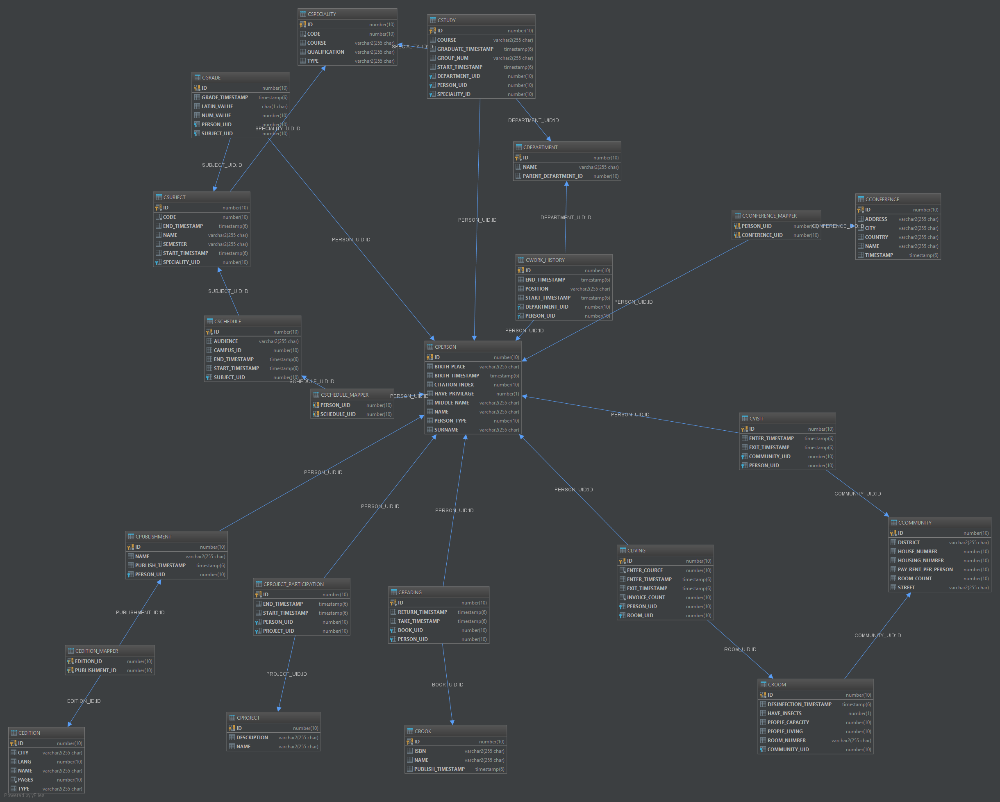

# Oracle Database Aggregator

Aggregates data from multiple databases and sync all in Oracle database.

## Build locally

Download [oJDBC (ojdbc7.jar)](https://www.oracle.com/technetwork/database/features/jdbc/jdbc-drivers-12c-download-1958347.html) and put it in */driver* folder.

Then run:
```bash
./gradlew bootJar
```

Execute (Located in /build/libs):
```bash
java -jar oracle-aggregator-1.0.0.jar
```

## Docker Compose

Order of execution: *Build -> Up -> Stop*

Build
```bash
docker-compose build
```

Run (add *-d* to use detached mode or it will be interactive)
```bash
docker-compose up
```

Stop
```bash
docker-compose stop
```

### Oracle Common Schema
